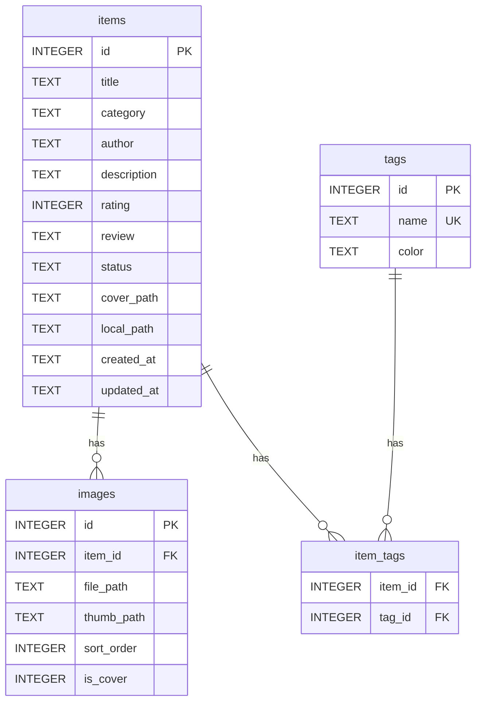

# 数据库设计

## 概览

- 数据库：SQLite 单文件 `acgm.db`，位于应用数据目录
- 迁移：`src-tauri/migrations/` 下的 SQL 脚本，首次连接数据库时由 tauri-plugin-sql 自动执行
- 主键：`INTEGER PRIMARY KEY AUTOINCREMENT`
- 时间字段：SQLite `TEXT`，UTC ISO 8601（`YYYY-MM-DD HH:MM:SS`）
- 外键：连接时启用 `PRAGMA foreign_keys = ON`，删除条目 / 标签时级联清理关联数据
- `items.updated_at` 由触发器自动维护，无需在业务代码中手动更新

## ER 图



## 表结构

### items（条目）

| 字段 | 类型 | 约束 | 说明 |
| --- | --- | --- | --- |
| id | INTEGER | PK，自增 | 主键 |
| title | TEXT | NOT NULL | 标题 |
| category | TEXT | NOT NULL，CHECK | `anime` / `comic` / `game` / `other` |
| author | TEXT | 可空 | 创作者（制作公司 / 作者 / 开发商） |
| description | TEXT | 可空 | 简介 |
| rating | INTEGER | CHECK 1-5，可空 | 个人评分（星级） |
| review | TEXT | 可空 | 个人评价（Markdown） |
| status | TEXT | NOT NULL，CHECK | `未开始` / `进行中` / `已完成` / `已弃坑` |
| cover_path | TEXT | 可空 | 封面图相对路径 |
| local_path | TEXT | 可空 | 关联的本地文件 / 文件夹绝对路径 |
| created_at | TEXT | NOT NULL，默认当前时间 | 创建时间 |
| updated_at | TEXT | NOT NULL，触发器维护 | 更新时间 |

索引：`category`、`status`、`rating`、`title`。

### tags（标签）

| 字段 | 类型 | 约束 | 说明 |
| --- | --- | --- | --- |
| id | INTEGER | PK，自增 | 主键 |
| name | TEXT | NOT NULL，UNIQUE | 标签名 |
| color | TEXT | 可空 | UI 展示颜色 |

### item_tags（条目-标签关联）

| 字段 | 类型 | 约束 | 说明 |
| --- | --- | --- | --- |
| item_id | INTEGER | 复合 PK，FK → items.id | 条目 |
| tag_id | INTEGER | 复合 PK，FK → tags.id | 标签 |

`ON DELETE CASCADE`：删除条目时解除其全部标签关联；删除标签时自动解除所有条目关联（不删除条目）。

### images（图片）

| 字段 | 类型 | 约束 | 说明 |
| --- | --- | --- | --- |
| id | INTEGER | PK，自增 | 主键 |
| item_id | INTEGER | NOT NULL，FK → items.id | 所属条目 |
| file_path | TEXT | NOT NULL | 原图相对路径 |
| thumb_path | TEXT | 可空 | 缩略图相对路径 |
| sort_order | INTEGER | NOT NULL，默认 0 | 排序 |
| is_cover | INTEGER | CHECK 0/1，默认 0 | 是否为封面 |

`ON DELETE CASCADE`：删除条目时同步删除图片记录。

## 迁移机制

迁移文件位于 `src-tauri/migrations/`，命名格式为 `YYYYMMDDHHMMSS_description.sql`。当前包含：

- `20260819000000_init.sql`：创建全部数据表、索引、触发器

版本由 tauri-plugin-sql 管理，已执行的迁移不会重复执行；新增结构变更时添加新的迁移文件即可。

## 存储布局

```text
{应用数据目录}/
├─ acgm.db                 # SQLite 数据库
└─ images/
   └─ {item_id}/           # 每个条目一个目录
      ├─ cover.jpg         # 封面原图
      ├─ cover_thumb.jpg   # 封面缩略图（宽 300px）
      ├─ shot-1.jpg
      └─ shot-1_thumb.jpg
```

数据库只保存相对路径（`images/{item_id}/...`），图片文件由 Rust 后端负责读写。
